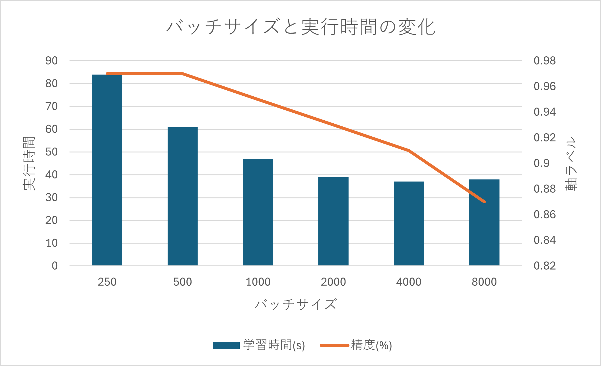

# 目的

手書き数字をDNN(Deep Neural Network)を使用して認識する。  

# 目次

- 学習と評価の実行
- モデルを使い、手書き文字の認識
- ニューラルネットワークの可視化
- エポック数とバッチサイズを変えた時の実行時間の変化

# 学習と評価の実行

sample.ipynbの上の方

# モデルを使い、手書き文字の認識

sample.ipynbの一番下

# ニューラルネットワークの可視化

graph.pngを参照


# エポック数とバッチサイズを変えた時の実行時間の変化




# 準備
```
sudo apt update
sudo apt-get install graphviz
pip install -r requirements.txt
```
